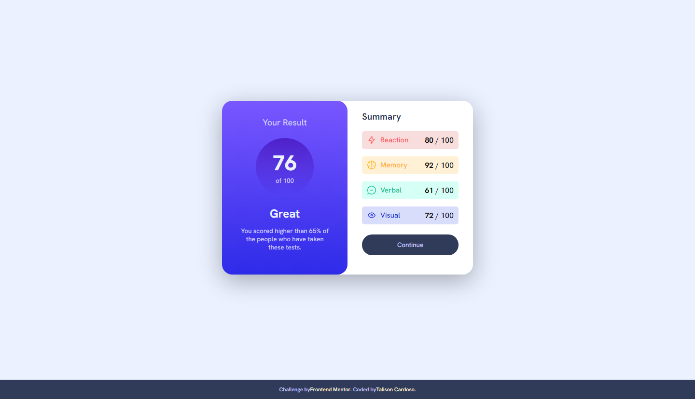
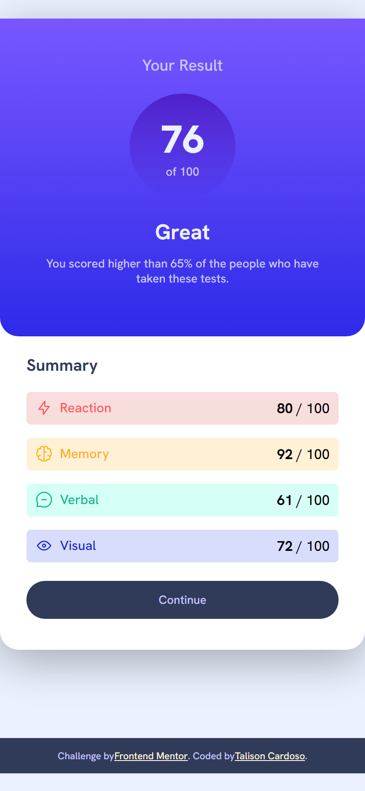

# Frontend Mentor - Results summary component solution

This is a solution to the [Results summary component challenge on Frontend Mentor](https://www.frontendmentor.io/challenges/results-summary-component-CE_K6s0maV). Frontend Mentor challenges help you improve your coding skills by building realistic projects. 

## Table of contents

- [Overview](#overview)
  - [The challenge](#the-challenge)
  - [Screenshot](#screenshot)
  - [Links](#links)
- [My process](#my-process)
  - [Built with](#built-with)
  - [What I learned](#what-i-learned)
  - [Continued development](#continued-development)
- [Author](#author)

## Overview

### The challenge

Users should be able to:

- View the optimal layout for the interface depending on their device's screen size
- See hover and focus states for all interactive elements on the page

### Screenshot





### Links

- Solution URL: [See the solution here](https://imbard.github.io/Results-summary-component/)

## My process

### Built with

- Semantic HTML5 markup
- CSS custom properties
- Flexbox
- CSS Grid
- Mobile-first workflow


### What I learned

I learned how to use linear gradient and am improving my css skills.


**Here's how I created the components that data.json will auto-populate**
```js
 for (let dat of data) {
      const img = document.createElement("img");
      img.setAttribute("src", dat.icon);
      const txtCat = document.createTextNode(dat.category);
      const container = document.createElement("span");
      container.appendChild(img);
      container.appendChild(txtCat);
      container.setAttribute("class", dat.category.toLowerCase())
      
      const span = document.createElement("span");
      span.innerHTML = `<b>${dat.score} </b> / 100`;
      
      const category = document.createElement("div");
      category.setAttribute("class", "cat"+dat.category)
      category.appendChild(container);
      category.appendChild(span)
      block.appendChild(category);
    }
```

If you want more help with writing markdown, we'd recommend checking out [The Markdown Guide](https://www.markdownguide.org/) to learn more.

### Continued development

I want to improve my abilities  in css with semantic code and my design


## Author

- Github - [Talison](https://www.github.com/imbard)
- Frontend Mentor - [@ImBard](https://www.frontendmentor.io/profile/ImBard)
- Twitter - [@imbard0](https://www.twitter.com/imbard0)
- Linkedin - [Talison Brendon](https://www.linkedin.com/in/talison-brendon/)
